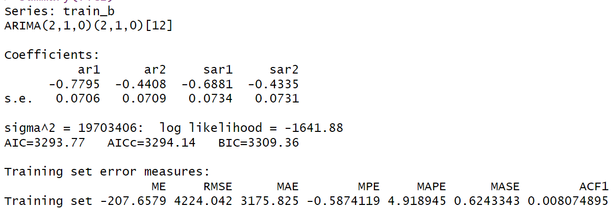

## R을 사용한
# 서울시 월별 헌혈 현황을 통한 시계열 분석 및 예측

 

다른 변수가 존재하지 않는 단순 월별 헌혈 현황 수 통계로  
**ETS 모형**, **ARIMA 모형**, **ARMA 오차 회귀모형**을 통해서만 예측 진행

 

## 데이터 설명

- 사용 데이터 : [서울시 헌혈현황(월별) 통계](http://data.seoul.go.kr/dataList/11001/S/2/datasetView.do)
- 2005년 1월부터 2021년 12월까지의 월별 헌혈 건수 실적 통계
- 동일인이 여러 차례를 실시해도 매회 실적으로 인정

blood_ts(헌혈현황 시계열 변환 데이터)의 시계열 그래프
  

 

blood_ts 시계열 분해 그래프

--- 
### 데이터 확인 결과  
- 계절에 따라 규칙적으로 변동하는 계절성이 파악
- 시간에 따라 꾸준히 증가하거나 감소하는 추세는 확인되지 않음
- 약 2007년 시점에서 진폭이 큰 폭으로 변화하였지만, 일시적인 증상으로 이상값으로 판단

 

**< 분산 안정화 필요성 확인>**

 training data 시계열 그래프

- 최적 람다값 = 1.18
- 람다값은 1에 가까운 값을 보이며 그래프는 진폭이 크게 변환하지 않는다 판단되어 **분산 안정화 불필요**

--- 

## ETS 모형 적합 

 최적 AICc를 기준으로 적합된 ETS 모형 

- Trend(추세) : X / Additive seasonal(계절성) : O / multiplicative error : O
- alpha 값이 0.2963으로 평균에 큰 변동은 존재하지 않음
- gamma 값이 0.0001로 0에 매우 가까워 계절성에 변동이 거의 존재하지 않음

 

**<ETS 모형 오차 가정 만족 확인>**

 ETS 모형 시계열, ACF 그래프, 히스토그램 

 ETS 모형 Ljung-Box 검정 결과 

- 시계열 그래프 : 0을 중심으로 위아래로 랜덤 분포, 별다른 추세나 계절성 X
- ACF 그래프 : 3시점, 7시점 이외에는 신뢰구간 안에 분포하여 해당 시점들은 이상값으로 판단
- 히스토그램 : 평균 0을 중심으로 대칭 분포
- p-value : 알파값 0.05보다 작으므로 귀무가설 기각

Ljung-Box 검정은 가정을 만족하지 않지만 다른 그래프들을 살펴보았을 때 가정을 만족하므로 **오차 가정을 만족하지 않는다 판단하기에는 어려움이 있음**

 

--- 

## ARIMA 모형 적합 

 training data 시계열 그래프, ACF 그래프, PACF 그래프 

 training data 단위근 검정 결과 

 - 시계열 그래프 : 추세 확인 X, 계절성 확인 O
 - ACF 그래프 : 일반 차분 필요 X, 계절 차분 필요 O
 - 단위근 검정 : 일반 차분 O, 계절 차분 X

따라서 일반 차분만을 진행한 모형 / 일반 차분, 계절 차분을 진행한 모형을 따로 진행 후 비교

 

**<일반 차분만 진행한 자료의 가능 모형 식별>**

 일반 차분만 진행한 자료의 ACF, PACF 그래프 

- ACF 그래프 : 명확한 계절 요소 확인

계졀 요소가 확인되기 때문에 **비정상 시계열 자료**로 모형 적합 진행할 수 없음

 

**<일반 차분과 계절 차분을 진행한 자료의 가능 모형 식별>**

 일반 차분, 계절 차분 진행한 자료의 ACF, PACF 그래프 

- 비계절형 요소 : 
  - ACF 그래프 : 1시점에서 절단 혹은 감소
  - PACF 그래프 : 2시점에서 절단 혹은 감소
 
가능한 비계절형 ARIMA 모형 : ARIMA(2,1,0), ARIMA(0,1,1), ARIMA(p,1,q)
  
- 계절형 요소 :
  - ACF 그래프 : 12시점만 신뢰구간 밖
  - PACF 그래프 : 12시점만 신뢰구간 밖, 24시점은 신뢰구간 경계에 있으며 크게 작은 값이 아니기에 유의하다 판단

가능한 계절형 ARIMA 모형 : ARIMA(1,1,0)12, ARIMA(2,1,0)12, ARIMA(0,1,1)12, ARIMA(P,1,Q)12 

 

**<모형 적합 결과>**

 적합된 ARIMA 모형 

적합 결과 **ARIMA(2,1,0)(2,1,0)12 모형**이 선택되었으며 계수들은 모두 유의적

 

**<ARIMA 모형 오차 가정 만족 확인>**

 ARIMA 모형 시계열 그래프, ACF 그래프, 히스토그램 

 ARIMA 모형 Ljung-Box 검정 결과 

- 시계열 그래프 : 0을 중심으로 위아래로 랜덤 분포, 별다른 추세나 계절성 X
- ACF 그래프 : 9시점 이외에는 신뢰구간 안에 분포하여 해당 시점들은 이상값으로 판단
- 히스토그램 : 평균 0을 중심으로 대칭 분포
- p-value : 알파값 0.05보다 크므로 귀무가설을 기각하지 못함

종합적으로 살펴봤을 때 오차가 백색잡음을 따르며 **예측 모형으로 사용 가능**
